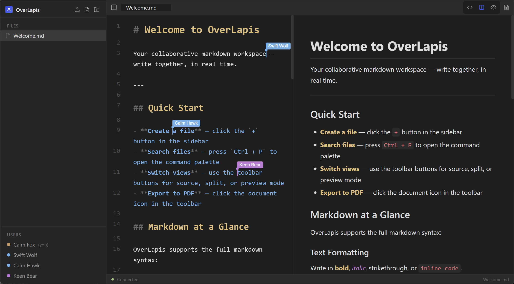

# OverLapis

A collaborative Markdown editor web app - Obsidian's look & feel meets Overleaf's real-time collaboration.



## Quick Start

The fastest way to run OverLapis - no Node.js setup required:

```bash
git clone https://github.com/morzelowski/overlapis.git
cd overlapis
docker build -t overlapis .
docker run -d -p 4444:4444 overlapis
```

Open [http://<local ip>:4444](http://<local ip>:4444). Share your IP with collaborators on the same network to edit together in real-time.

> **Note:** The image declares `/app/docs` as a Docker volume, so your notes survive container restarts automatically. To access files directly from the host, use a bind mount instead:
>
> ```bash
> docker run -p 4444:4444 -v ~/my-notes:/app/docs overlapis
> ```

## Features

- **Real-time collaboration** - multiple users edit the same file simultaneously with conflict-free merging (Yjs CRDT)
- **Live cursors** - see collaborators' cursors and names inline as they type
- **Obsidian-style UI** - dark theme, file tree sidebar, tabbed editing
- **Markdown preview** - toggle between editor and rendered preview per file
- **Command palette** - fuzzy-search and open files (`Ctrl+P`)
- **Persistent storage** - files saved as `.md` on the server filesystem
- **Docker support** - single container serves both frontend and backend

## Tech Stack

| Layer | Technology |
|---|---|
| Frontend | React 18, TypeScript, Vite |
| Editor | CodeMirror 6, `@codemirror/lang-markdown` |
| Collaboration | Yjs, y-websocket, y-codemirror.next |
| State | Zustand |
| Markdown | marked |
| Backend | Express 4, ws, Node 20 |
| Styling | Plain CSS, custom Obsidian dark theme |

## Getting Started

### Prerequisites

- Node.js 20+
- npm 10+

### Development

```bash
# Clone the repo
git clone https://github.com/morzelowski/overlapis.git
cd overlapis

# Install all workspace dependencies
npm install

# Start client (port 5173) and server (port 4444) concurrently
npm run dev
```

Open [http://localhost:5173](http://localhost:5173) in your browser. Open a second tab or window to see real-time collaboration in action.

### Individual services

```bash
npm run dev:client   # Vite dev server only (port 5173)
npm run dev:server   # Express/WS server only (port 4444)
```

### Production build

```bash
npm run build        # Compiles client to client/dist/
```

## Project Structure

```
overlapis/
├── client/          # React frontend
│   └── src/
│       ├── components/
│       │   ├── Editor/          # CodeMirror 6 editor pane + extensions
│       │   ├── Sidebar/         # File tree
│       │   ├── Tabs/            # Open file tabs
│       │   ├── CommandPalette/  # Fuzzy-search file opener
│       │   └── common/          # Shared UI components
│       ├── hooks/               # YjsContext, useYjs, etc.
│       ├── services/            # API client helpers
│       ├── stores/              # Zustand app store
│       ├── styles/              # CSS custom properties (variables)
│       └── types/               # TypeScript type definitions
├── server/          # Express + WebSocket backend
│   └── src/
│       ├── routes/          # REST API endpoints
│       ├── services/        # Filesystem service (path traversal protection)
│       ├── types/           # TypeScript type definitions
│       └── ws.ts            # y-websocket room handler
├── docs/            # Markdown vault (created at runtime by the server)
├── Dockerfile
└── package.json     # npm workspaces root
```

## Architecture

```
Browser A ──┐
            ├──► WebSocket (Yjs / y-websocket) ──► Server ──► docs/ filesystem
Browser B ──┘         (proxied via Vite /ws)
```

- Each file maps 1:1 to a Yjs room; state is synced between all connected clients.
- REST endpoints (`/api/files`) handle file CRUD.
- Yjs document content is debounce-written to the `docs/` directory on the server.

## Type Checking

```bash
cd client && npx tsc --noEmit
cd server && npx tsc --noEmit
```

## Credits

- [@k-Czaplicki](https://github.com/k-Czaplicki) - contributions to the project

## License

[GNU Affero General Public License v3.0](LICENSE.md) - free to use, modify, and distribute. If you run a modified version as a network service, you must make the source code available to its users. See [LICENSE.md](LICENSE.md) for full terms.
